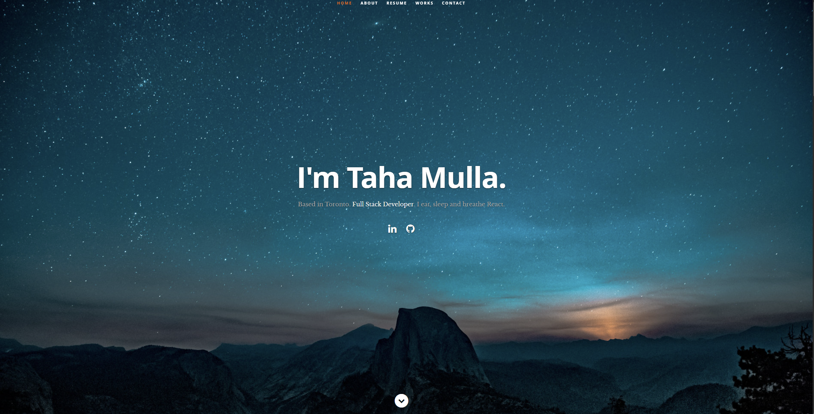

# Taha Mulla React JS Resume and Digital Portfolio

## Resume Description

This portfolio is made using React. The data on the portfolio is directly linked to a JSON file. Any changes to the portfolio can be made in the JSON file. The changes will then be reflected on to the portfolio. This allows you to customize your own personal portfolio that can be used for applying to jobs or other personal uses.

## Credits

##### Original Idea

<a href="https://github.com/tbakerx/react-resume-template/blob/master/README.md">Inspiration from Tim Baker (tbakerx) and Sonny Sangha (sonnysangha)</a>
